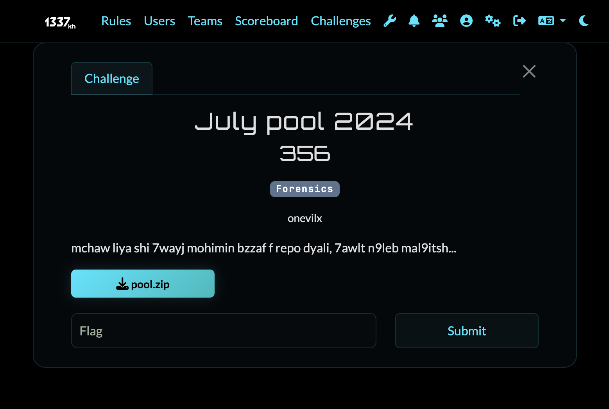
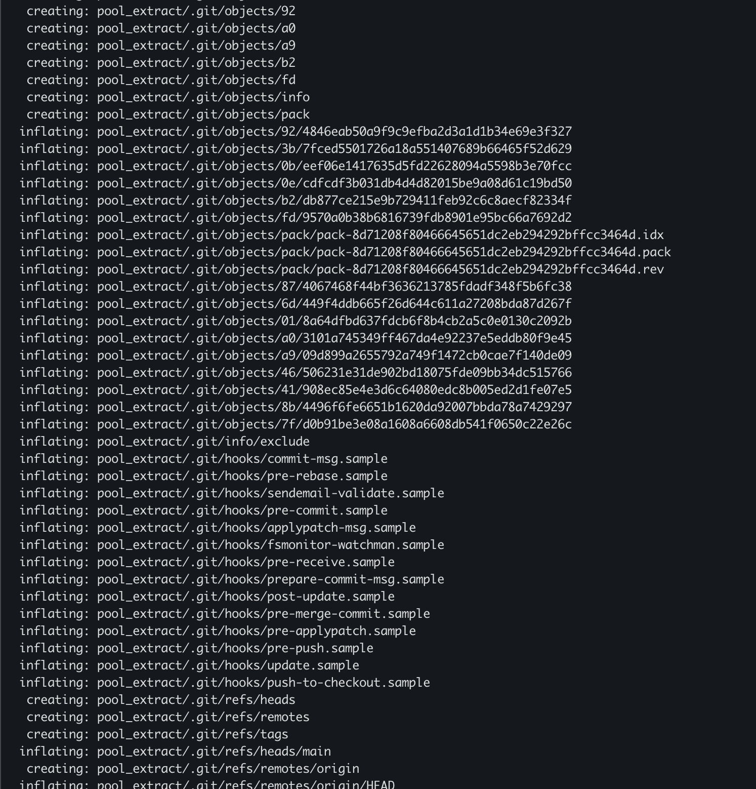
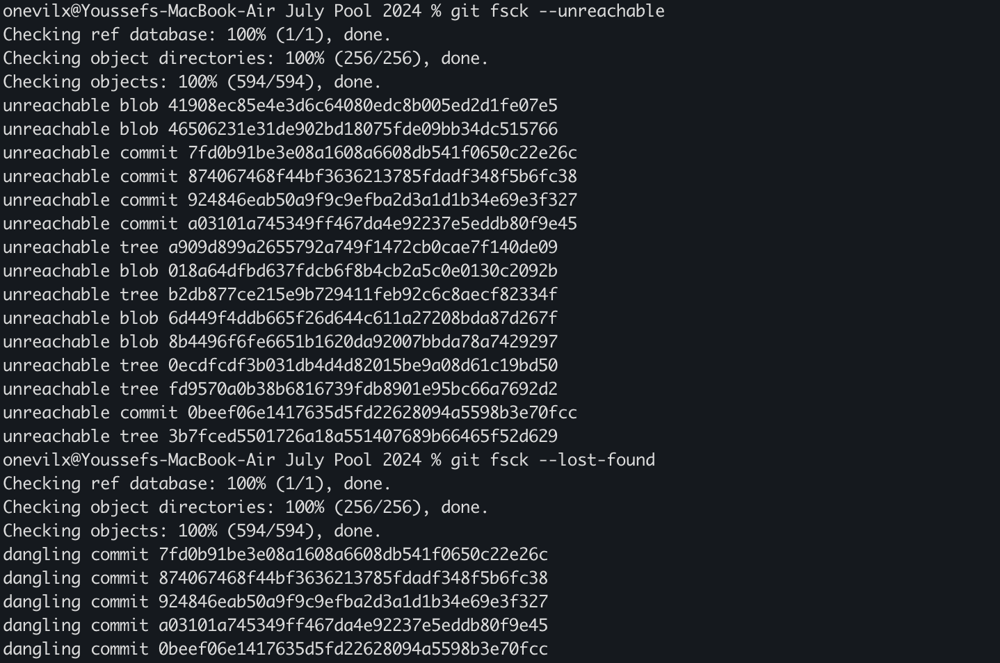
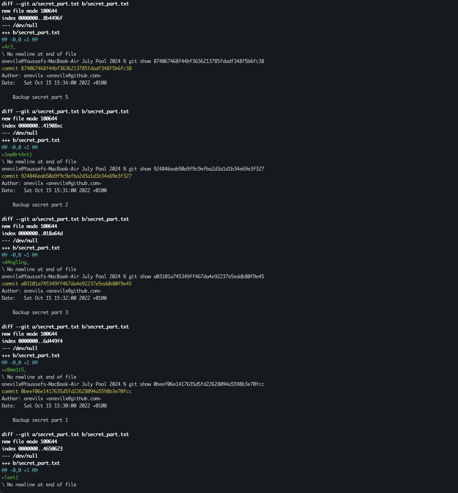

# Misc Challenge: July pool 2024

## Challenge Overview
- **Category:** Forensics
- **Difficulty:** Easy
- **Vulnerability:** Sensitive Data Exposure in Version Control History



## Description
In this challenge, we are provided with an archive file named `pool.zip`. The archive contains the project files of a student from the 1337 piscine (a coding bootcamp). Among the C and Shell script files, there is a hidden `.git` directory. The goal is to perform Git forensics to recover a hidden or deleted flag.

## Methodology & Exploit

When developers use version control systems like Git, every commit, change, and file addition is logged and stored. Even if a file containing a sensitive secret (like an API key, password, or CTF flag) is deleted in a later commit, it remains accessible in the project's Git history.

### Step 1: Extraction & Reconnaissance
First, we unzip the provided archive and navigate into the extracted directory.
```bash
unzip pool.zip -d pool_extract
cd pool_extract
```



Listing the files, including hidden ones (`ls -la`), reveals a `.git` folder. This means the entire directory is a Git repository, and we can inspect its history.

### Step 2: Exploring the Git History
The most common way to review a Git repository's history is using the `git log` command. This will print out a massive log of all changes across the repository. To find the flag efficiently, we can `grep` the output since we know flags are formatted as `leet{...}`.

```bash
git log -p | grep -i "leet{"
```

However, this returned nothing! The standard commit history didn't contain the flag, so my main focus shifted to deeper `.git` internals.

### Step 3: Deep Diving into Git Forensics
If standard `git log` doesn't immediately reveal the flag, the secret may have been committed to a different branch, or the commit might have been detached/orphaned (meaning it's not part of the current active timeline, but the object still exists in the `.git` database).

We can search through all branches and commit references:
```bash
git log --all -p | grep -i "leet{"
```


Still no output.

If the flag was staged and then reset without ever making it into a proper commit on a branch, we can look for orphaned blobs (files) or dangling commits inside the Git object database using `git fsck`:
```bash
git fsck --unreachable
git fsck --lost-found
```


As you can see, the output is huge. This command recovers unreachable blobs into `.git/lost-found/other/` and dangling commits into `.git/lost-found/commit/`. 

I started using `git show` on each dangling commit to see what it contained:



One of the dangling commits revealed a fragmented piece of the flag! After reconstructing it all, we got the final flag:
```text
leet{d4ngl1ng_c0mm1t5_4r3_1mp0rt4nt}
```

## The idea
This challenge was heavily inspired by the misc challenge seen in the **AKASEC CTF Finals**. It aims to teach players that just because a file is "deleted" or "reset" in Git, doesn't mean it is actually gone from the `.git` database!

## Resources
If you want to learn more about Git internals and recovering lost data, check out these resources:
- [Git Documentation: git-fsck](https://git-scm.com/docs/git-fsck)
- [Atlassian: Rewriting History & Data Recovery](https://www.atlassian.com/git/tutorials/rewriting-history)
- [HackTricks: Git Forensics](https://book.hacktricks.xyz/network-services-pentesting/pentesting-web/git)
