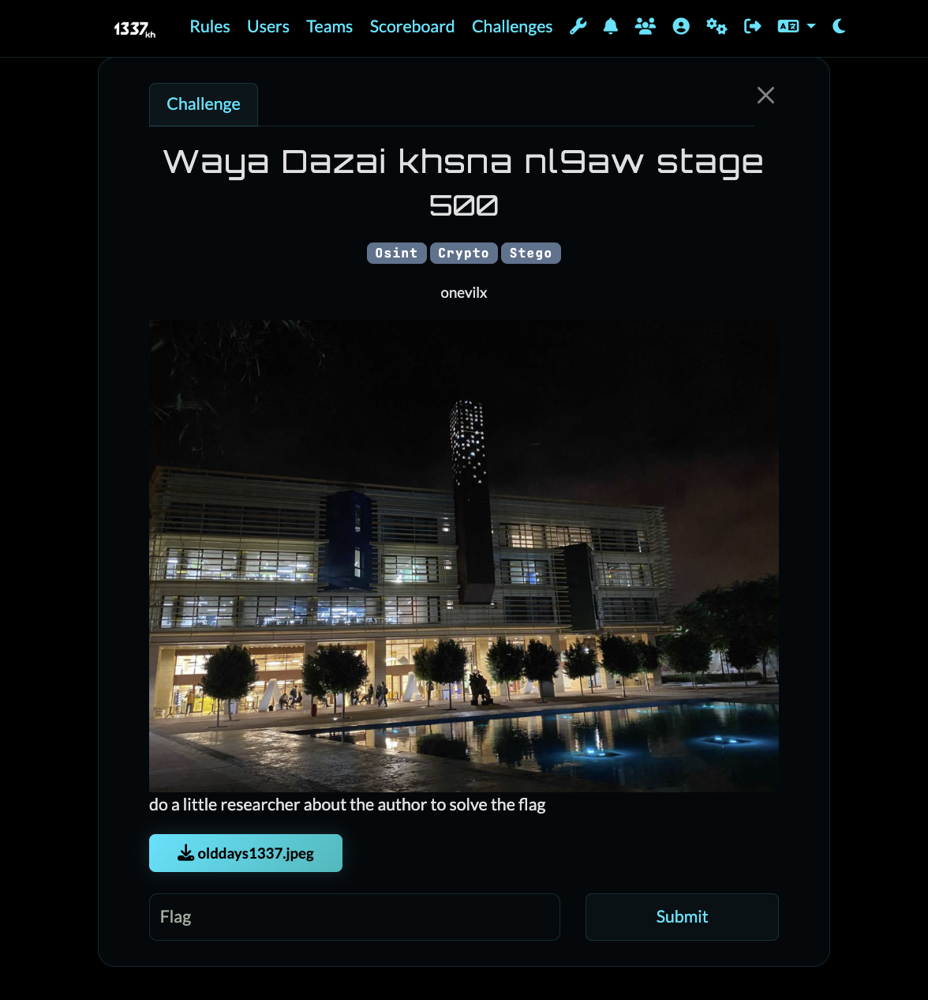
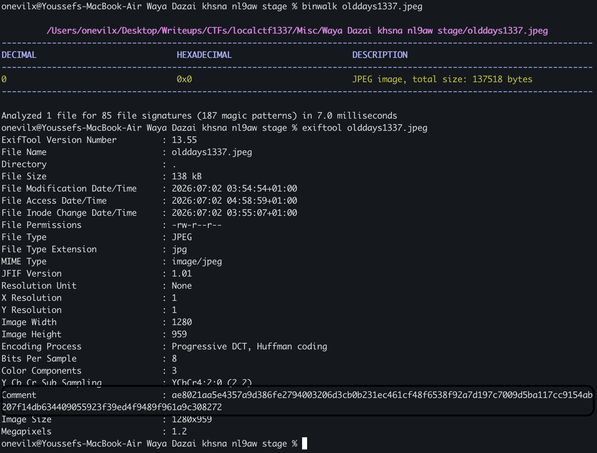
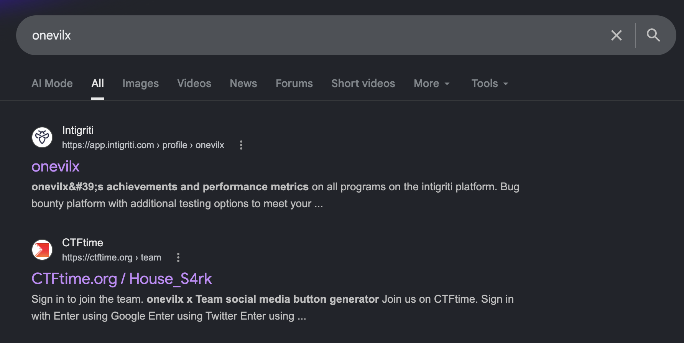
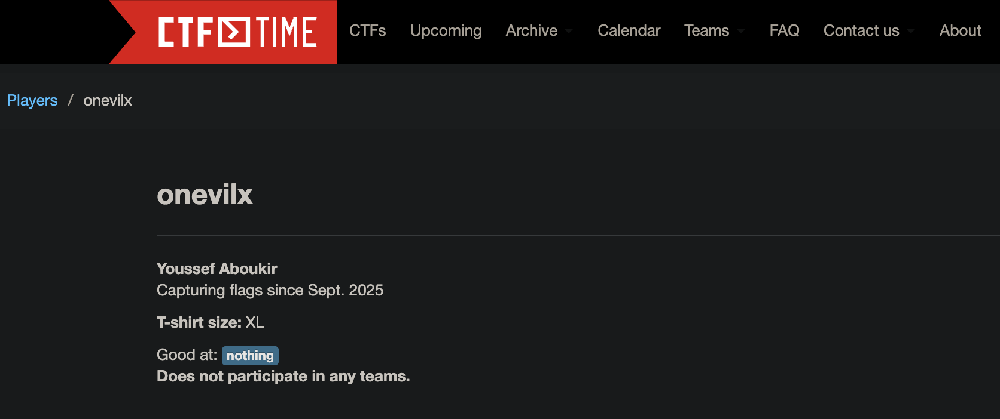
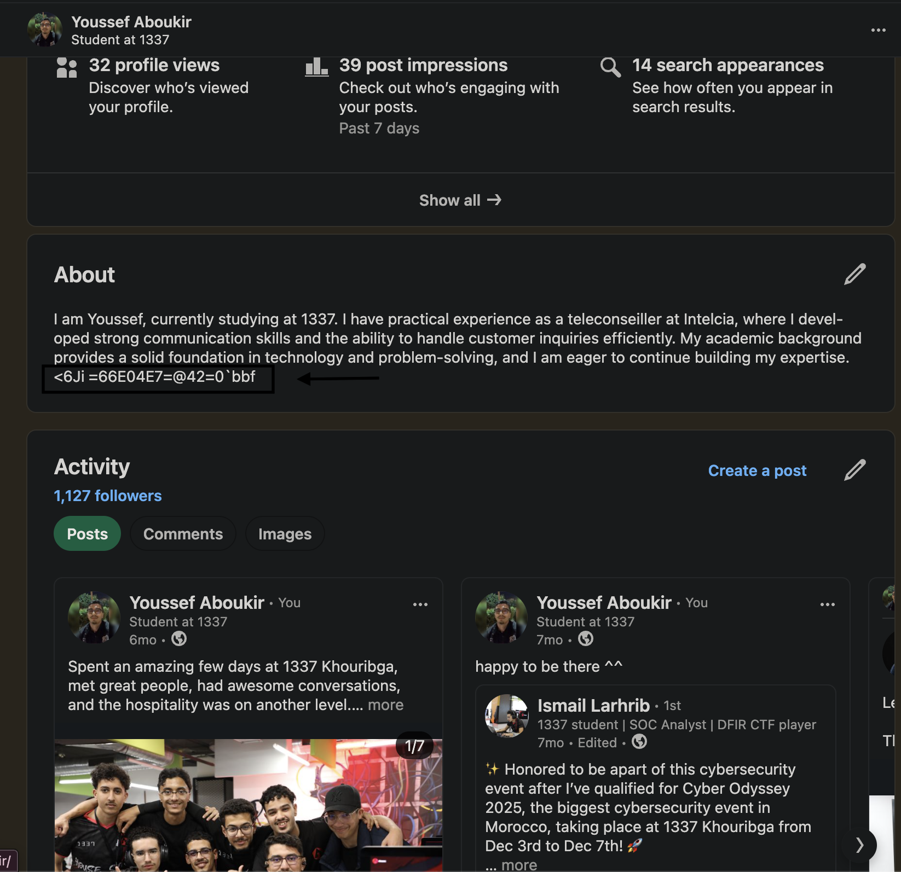
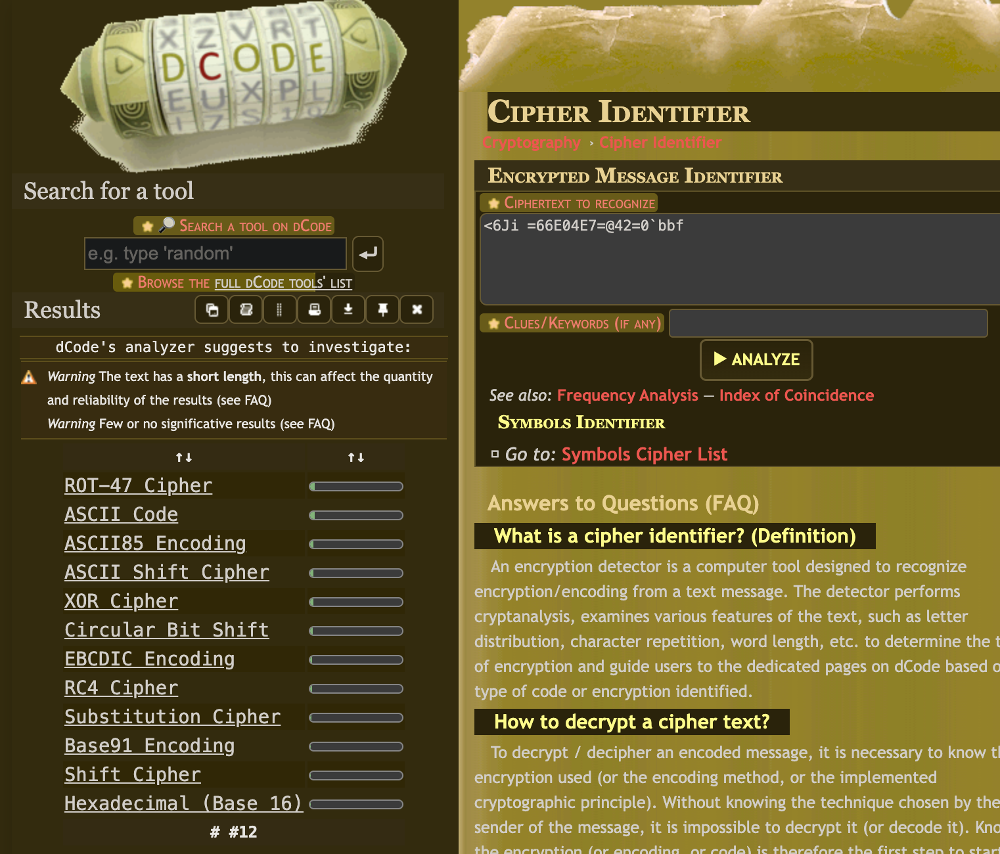
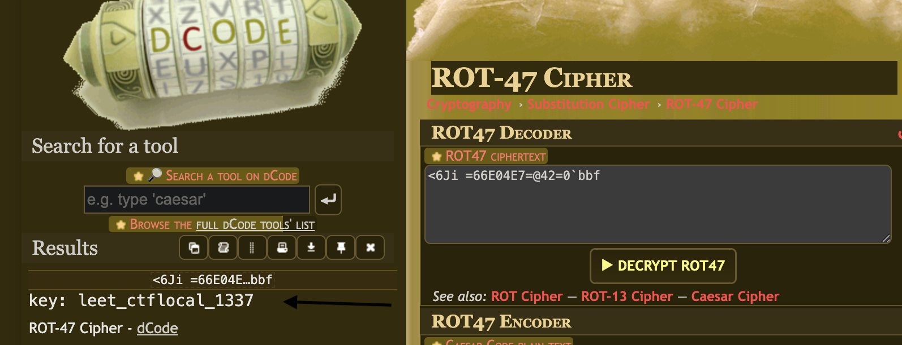
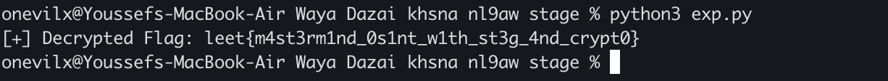

# Misc Challenge: Waya Dazai khsna nl9aw stage

## Challenge Overview
- **Category:** Osint / Crypto / Stego
- **Difficulty:** Hard
- **Vulnerability:** Hidden Data (JPEG COM Marker), OSINT skills, AES-CBC Decryption



## Description
In this challenge, we are provided with a JPEG image (`olddays1337.jpeg`). The challenge spans across three different categories, requiring us to chain together OSINT, Steganography, and Cryptography to successfully uncover the hidden secret.

## The Vulnerability & Methodology
By investigating the provided JPEG, we can uncover that hidden data has been injected directly into the file's structure. 

### 1. The Steganography Step
JPEGs are composed of markers. Standard image viewers ignore unknown or comment markers, allowing data to be hidden inside the file without corrupting the visual image

Analyzing the hex dump of `olddays1337.jpeg` (or using a tool like `exiftool` or `binwalk`), we find a JPEG COM (Comment) marker `FF FE` injected right before the Start of Stream (`FF DA` / SOS) marker. 



This comment contains a string of hexadecimal characters, this is the encrypted long hex flag, so we need the key to decrypted it.

### 2. The OSINT Step
here we need to use osint as mention in the description we need to do a little researcher about the author, so that we did we google up about onevilx


so likely in the ctftime will appear his full name:



and yes, now we got his full name, the thing here is there is already hint in the challenge which is say: Waya Dazai khsna nl9aw STAGE, so stage means internship, and internship means most known platform is LinkedIn. so i went to search up about him and i found him, but not only him also the key:



we found it the key, but is this the valid key or is it in another form ``<6Ji =66E04E7=@42=0`bbf``, so i went to see which form is this



the key is defenietly in another form, and the most promising one is rot47 so i did rot47 and found the key:



and the key is : `leet_ctflocal_1337`, now final step we must to do is to decrypt the flag with the key we have.

### 3. The Cryptography Step
The hex string in the comment marker represents an Initialization Vector (IV) and a Ciphertext encrypted with AES-CBC.
- The first 16 bytes (32 hex characters) are the IV.
- The remaining bytes are the encrypted flag.

We need to derive the AES encryption key using the passphrase we found via OSINT. A common method is taking the SHA-256 hash of the passphrase.

## The Exploit Script
We can write a simple Python script using `pycryptodome` to extract the hex string, derive the key, and decrypt the flag.

```python
import hashlib
import binascii
from Crypto.Cipher import AES
from Crypto.Util.Padding import unpad

# 1. Provide the passphrase found via OSINT
PASSPHRASE = "leet_ctflocal_1337"

# 2. Derive the 256-bit AES key
key = hashlib.sha256(PASSPHRASE.encode()).digest()

# 3. Read the hex string from the JPEG (this is the data extracted from the COM marker)
# in the extracted_hex you must add the long hex you found in the comment field.
extracted_hex = "ae8021aa5e4357a9d386fe2794003206d3cb0b231ec461cf48f6538f92a7d197c7009d5ba117cc9154ab207f14db634409055923f39ed4f9489f961a9c308272"
extracted_bytes = binascii.unhexlify(extracted_hex)

# 4. Split the IV and the Ciphertext
iv = extracted_bytes[:16]
ciphertext = extracted_bytes[16:]

# 5. Decrypt using AES-CBC
cipher = AES.new(key, AES.MODE_CBC, iv)
padded_flag = cipher.decrypt(ciphertext)

# 6. Unpad and print the flag
flag = unpad(padded_flag, AES.block_size)
print("[+] Decrypted Flag:", flag.decode())
```
## Running the Exploit
Running the script outputs the decrypted flag:



```text
[+] Decrypted Flag: leet{m4st3rm1nd_0s1nt_w1th_st3g_4nd_crypt0}
```

## Resources
If you want to dive deeper into the topics covered in this challenge, check out these excellent resources:
- [JPEG File Structure & Markers](https://en.wikipedia.org/wiki/JPEG#Syntax_and_structure)
- [OSINT Framework (For finding people & info)](https://osintframework.com/)
- [PyCryptodome Documentation (AES Encryption)](https://pycryptodome.readthedocs.io/en/latest/src/cipher/aes.html)
