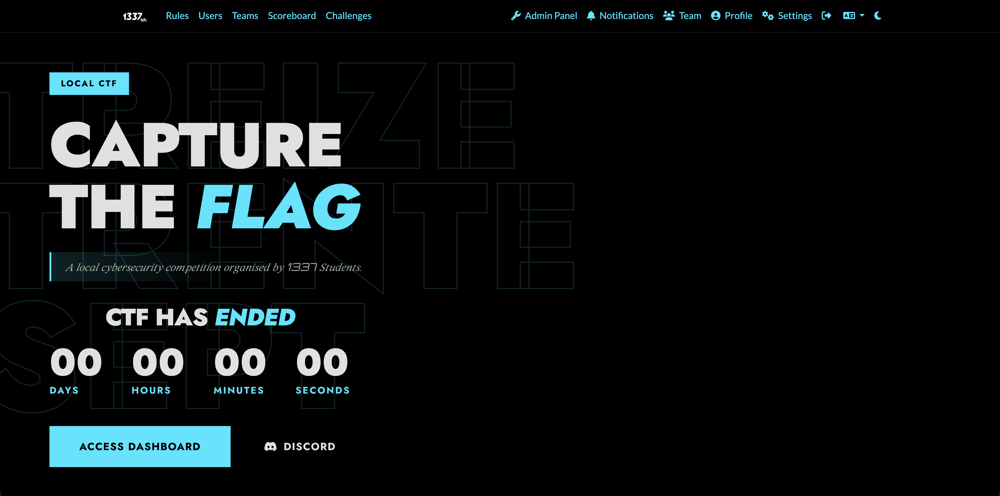

# Local CTF 1337 - Writeups & Source Code

## Overview
Welcome to the official repository for the **Local CTF 1337** writeups and source code! This repository contains detailed, step-by-step solutions for challenges featured in the local cybersecurity competition organized by 1337 students.

  

Whether you're looking to understand the core concepts behind the vulnerabilities, or you want to spin up the challenges locally to practice, you'll find everything you need right here.

## Challenge Writeups

### Web Security
| Challenge | Vulnerability | Difficulty | Writeup |
| :--- | :--- | :--- | :--- |
| **Notebook** | SSTI & WAF Bypass | Easy | [Read Writeup](./Web/Notebook/notebook_writeup.md) |
| **New Intra** | IDOR & Mass Assignment | Medium | [Read Writeup](./Web/new%20intra/new-intra_writeup.md) |

### Misc
| Challenge | Topic | Difficulty | Writeup |
| :--- | :--- | :--- | :--- |
| **July Pool 2024** | Forensics | Easy | [Read Writeup](./Misc/July%20Pool%202024/july_pool-2024_writeup.md) |
| **Waya Dazai khsna nl9aw stage** | OSINT, Stegano, Crypto | Hard | [Read Writeup](./Misc/Waya%20Dazai%20khsna%20nl9aw%20stage/Waya_Dazai_writeup.md) |

## Source Code & Local Testing
For challenges like the **New Intra** web challenge, the full Flask backend source code (`app.py`), `Dockerfile`, and HTML templates are included in the repository. 

You can spin up these environments locally to practice the exploits yourself and analyze the root cause of the vulnerabilities directly from the backend!

##  About the Author
This repository, including all challenges and their corresponding writeups, was created by **onevilx**. If you have any questions, want to discuss cybersecurity, or are looking to collaborate, feel free to connect with me on LinkedIn!