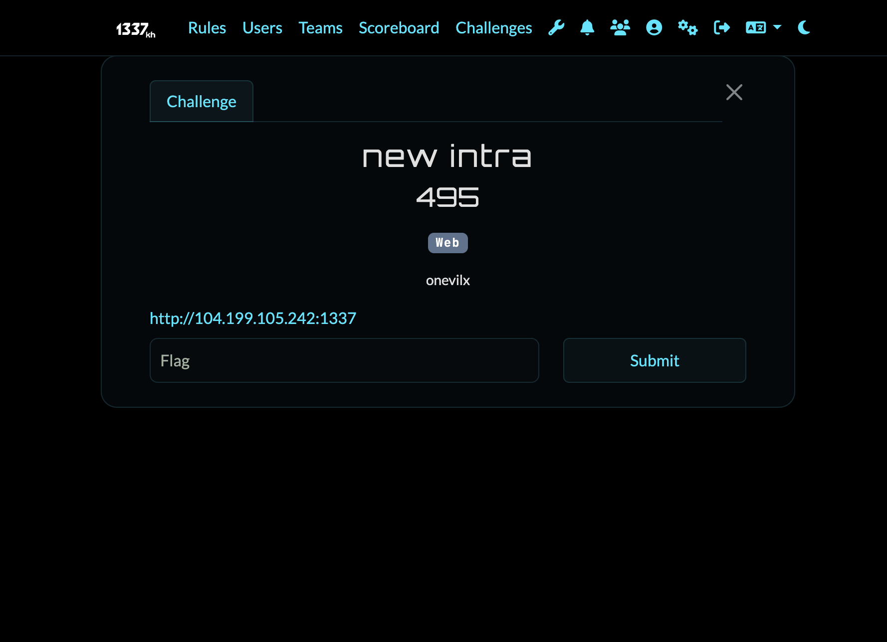
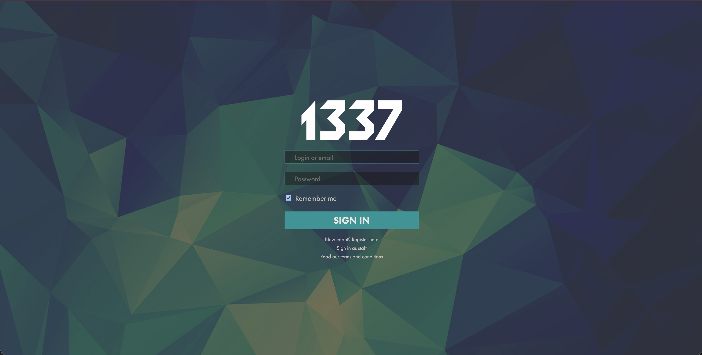
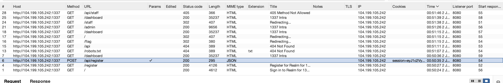
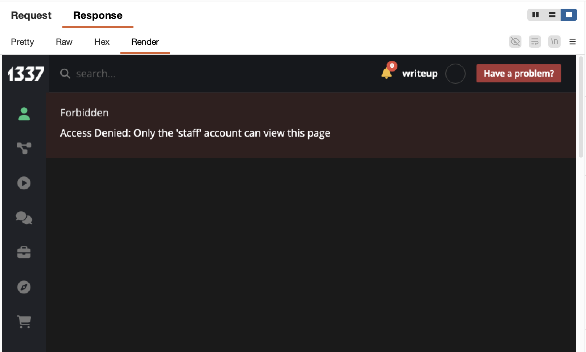
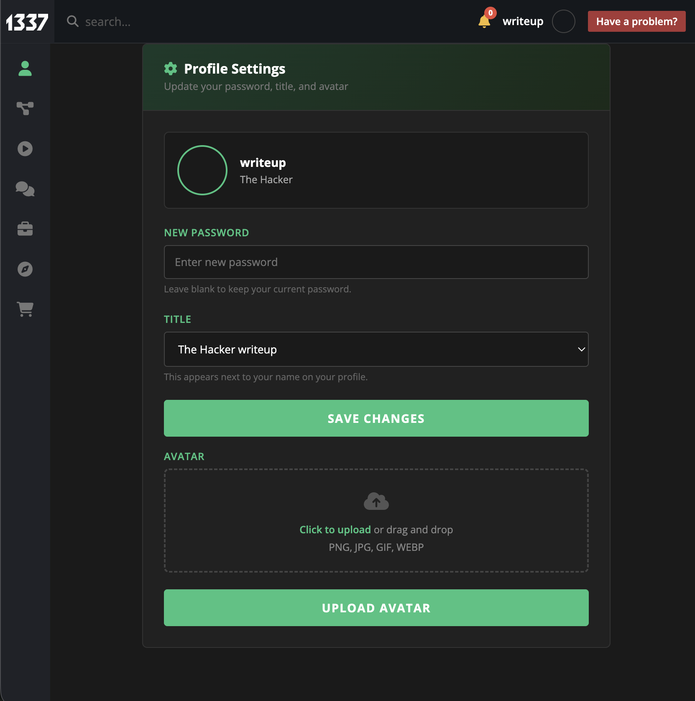
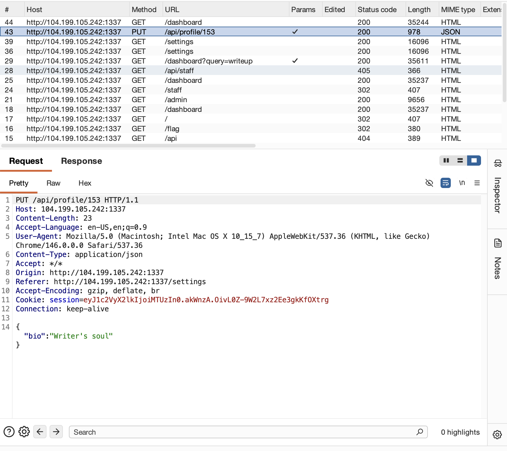
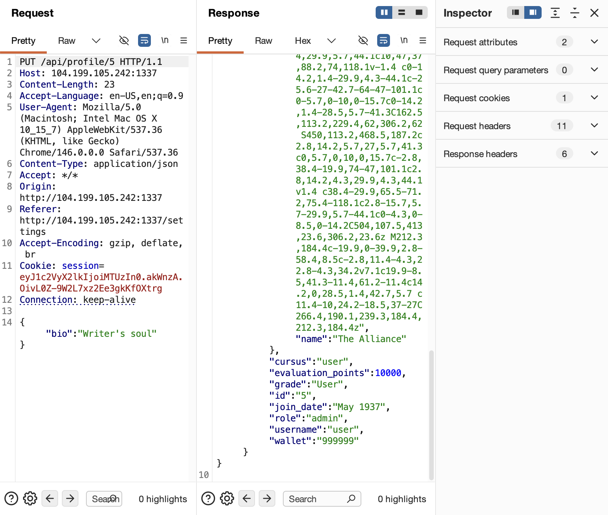
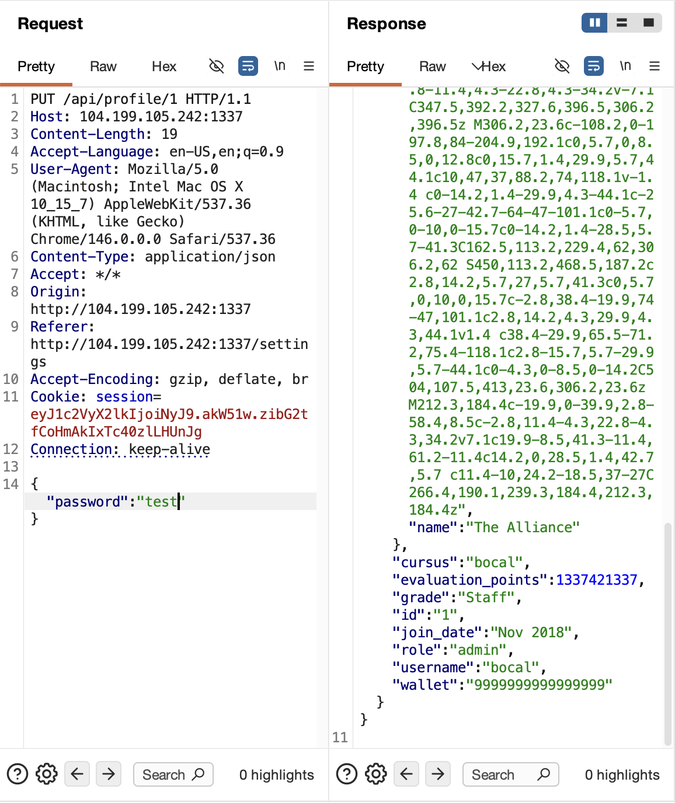
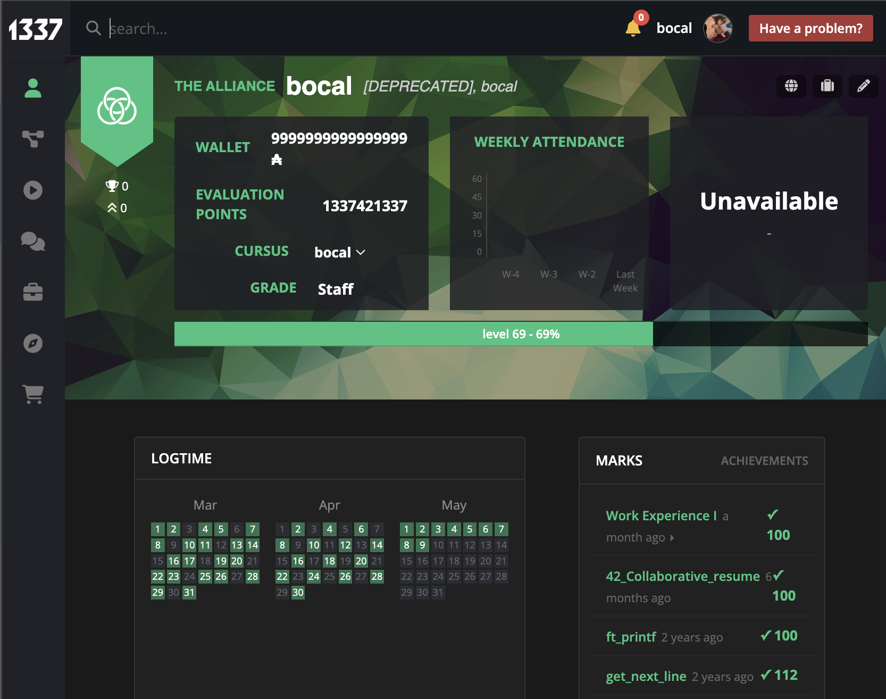
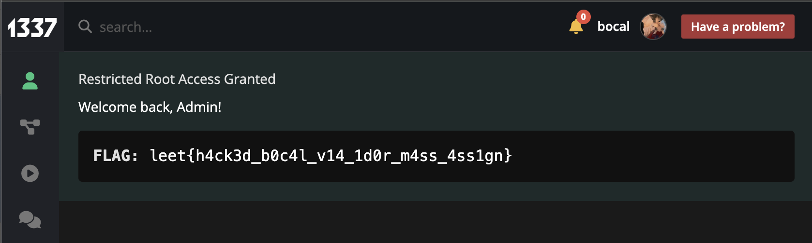

# Web Challenge: new intra

## Challenge Overview
- **Category:** Web
- **Difficulty:** Medium
- **Vulnerability:** Insecure Direct Object Reference (IDOR) with Mass Assignment leading to Account Takeover



## Description
This challenge features a student portal with profiles, avatars, and a staff dashboard. The objective is to retrieve the flag, which is only accessible to the highest-privileged admin account: `bocal`. We are given no source code, making this a purely blackbox engagement.



## Challenge Analysis

### 1. Initial Reconnaissance
Upon exploring the application, I found several key features:
- A registration and login system for students.
- A profile page where users can update their details (bio, avatar, password).
- A separate `/staff` login portal.
- An `/admin` dashboard that is heavily restricted.

First, after creating an account, I checked if there was anything interesting in `robots.txt` or common paths like `/flag` or `/staff`. The paths existed but redirected me.



However, I found something much more interesting at the `/admin` endpoint. Checking the response data, I saw it returned a `403 Forbidden` error, meaning normal users are not allowed to view its contents.



### 2. Discovering the Vulnerability
Next, I navigated to the settings page to see if there was a way to interact with the server. I found functionality to upload files and change my password or title:



Initially, I suspected this might lead to Remote Code Execution (RCE) via a malicious file upload. However, when I tried to change my title from "the hacker" to "writer's soul", I noticed something interesting in the proxy history:



My profile ID was `153`. I wondered if I could access or modify other users' data by simply switching this number in the URL. I tested it, and to my surprise, I could access and change other users' passwords and titles!



### 3. Exploitation
*Note: I tried to change the password for other normal users like myself, but the server protected against it. However, I noticed that there were built-in profiles (IDs 1 to 6) where I actually **could** change the password!*

Through continuous testing, I deduced that I needed to change the password of the staff profile to gain access. Following the common pattern that the first account created is usually the admin, I targeted `/api/profile/1`. You can easily fuzz this endpoint to test all accounts and check which one is accessible for the `/admin` endpoint via the `/staff` portal.

By injecting the password field into my request (a Mass Assignment vulnerability combined with the IDOR), I successfully updated the admin's password:



After that, I navigated to the `/staff` portal and logged in using the staff account username (`bocal`) and my new password (`test`). It worked!



Finally, I went to the `/admin` endpoint, and I was granted full access!



The flag was:
```text
leet{h4ck3d_b0c4l_v14_1d0r_m4ss_4ss1gn}
```
## Post CTF
Since this was a blackbox challenge during the CTF, players didn't have access to the source code. However, as the creator of this challenge, I've decided to open-source the backend in this repository [New intra](<new intra>) so you can spin it up locally and see exactly why the exploit works!

If we look at `app.py`, here is the exact code responsible for the vulnerability in the profile update API:

```python
@app.route('/api/profile/<user_id>', methods=['PUT'])
def update_profile(user_id):
    # IDOR flaw: here It allows modifying your own profile OR any builtin profile (IDs 1-6)
    builtin_ids = {'1', '2', '3', '4', '5', '6'}
    if user_id != session['user_id'] and user_id not in builtin_ids:
        return jsonify({"error": "You can only modify your own profile"}), 403
    
    # Mass Assignment flaw: Blindly accepting and setting the password in the session
    data = request.json
    if 'password' in data:
        session['bocal_pw'] = data['password'] # <-----
```

The intentional flaw here is twofold. First, I added a check to stop players from griefing each other, but explicitly allowed them to modify the built-in accounts (IDs 1 through 6). Second, the API blindly accepts any password sent in the JSON payload and slaps it directly into the session cookie, rather than updating a database. This is exactly why injecting `"password": "test"` bypasses the intended logic and grants access!

## Resources
Helpful articles to learn more about IDOR and Mass Assignment:
- [PortSwigger: Insecure Direct Object References (IDOR)](https://portswigger.net/web-security/access-control/idor)
- [OWASP: Mass Assignment Cheat Sheet](https://cheatsheetseries.owasp.org/cheatsheets/Mass_Assignment_Cheat_Sheet.html)
- [OWASP: API6:2019 - Mass Assignment](https://owasp.org/API-Security/editions/2019/en/0xa6-mass-assignment/)
- [Hackviser: IDOR Attack Guide](https://hackviser.com/tactics/pentesting/web/idor)
